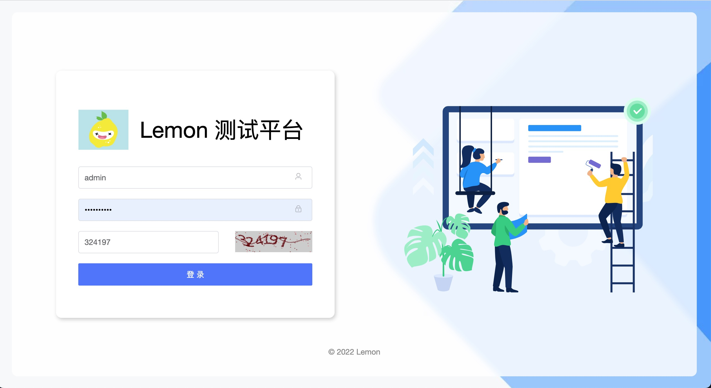
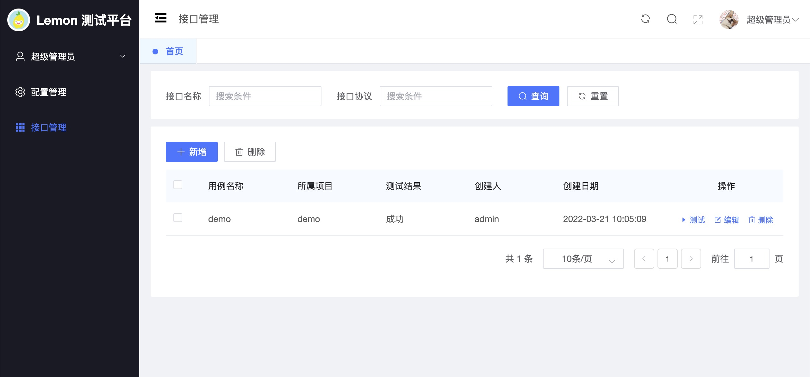
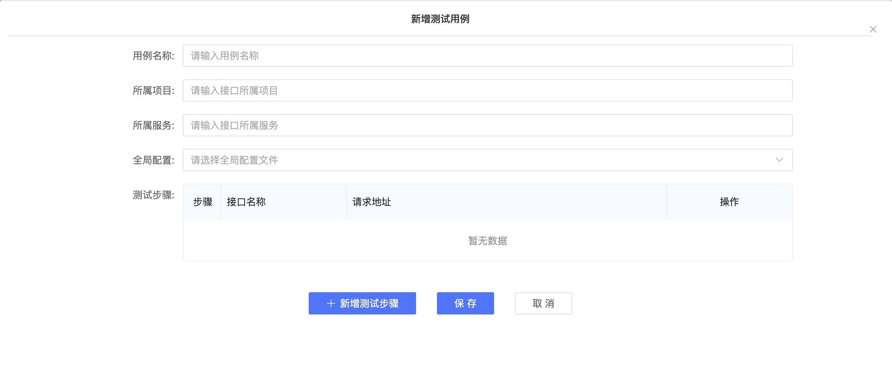
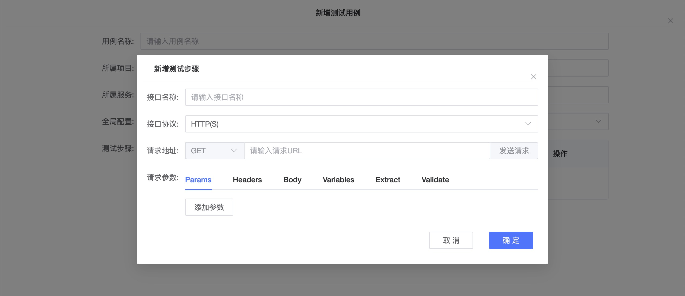

# Lemon
`Lemon` 是一站式开源持续测试平台，支持接口测试、性能测试、用例管理、覆盖率测试等。

### Lemon 的优势

采用全新技术（Vue3 + Go）技术栈进行开发，性能超强,测试引擎支持httprunner最新版本，支持任意扩展开发新的功能。

### UI展示

### 部署方式

##### server端

1. 新建数据库，并导入server/sql/lemon.sql文件
2. 修改server/config.yaml文件中数据库相关配置
3. 如果是开发，需要执行`go run main.go`,启动服务
4. 如果是部署，需要执行`GOOS=linux GOARCH=amd64 go build -o lemon`生成部署文件

##### web端

1. 进入web目录，执行`npm install`命令,安装依赖包
2. 如果是开发调试，需要执行`npm run serve`,启动服务
3. 如果是部署使用，需要编译打包:`npm run build`，之后把dist部署到服务器 
4. 使用lemon/lemon用户名和密码登录使用

### 技术栈

-   后端: [Gin](https://gin-gonic.com/)
-   前端: [Vue.js](https://vuejs.org/)
-   中间件: [MySQL](https://www.mysql.com/)
-   测试引擎: [Httprunner](https://github.com/httprunner/httprunner)

### 交流方式

- 关注微信公众号:TalkPython，第一时间获得最新信息。
- 添加微信号(yangyunfei07)，加群交流共建。

### RoadMap

- [] 测试任务管理
- [] 支持性能测试
- [] 接口测试报告
- [] 性能测试报告
- [] 测试用例管理
- [] Mock Server

### 致谢

-   [gin-vue-admin](https://github.com/flipped-aurora/gin-vue-admin)：Lemon 使用gin-vue-admin 开源框架作前后端分离开发
-   [httprunner](https://github.com/httprunner/httprunner)：Lemon 使用了 httprunner 作为测试引擎
-   [ElementPlus](https://element-plus.gitee.io/)：感谢 Element 提供的优秀组件库