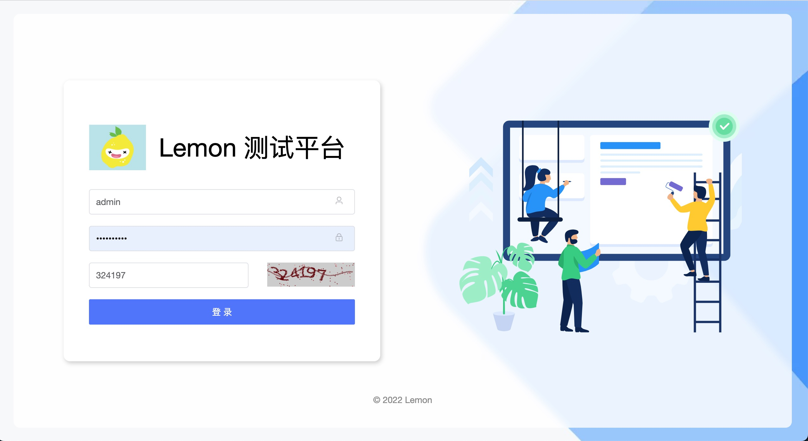
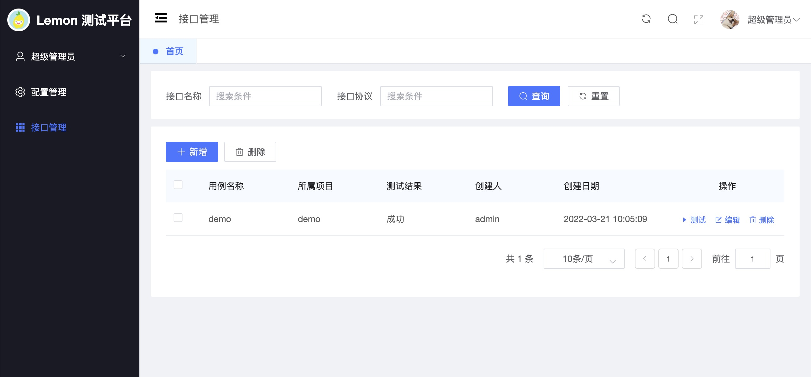
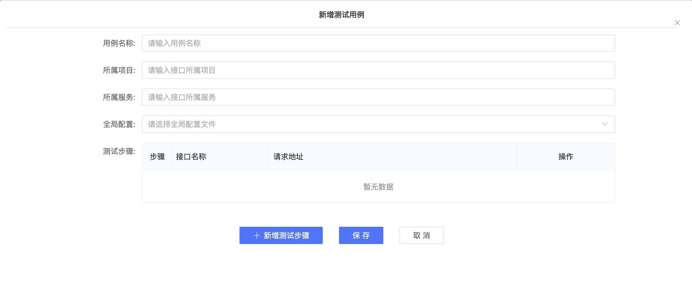

# Lemon
Lemon 是一站式开源持续测试平台，支持接口测试、性能测试、用例管理、覆盖率测试等。

### Lemon 的优势

采用全新技术（Vue3 + Go）技术栈进行开发，性能超强,测试引擎支持httprunner最新版本，支持任意扩展开发新的功能。

### UI 展示

### 技术栈

-   后端: [Gin](https://gin-gonic.com/)
-   前端: [Vue.js](https://vuejs.org/)
-   中间件: [MySQL](https://www.mysql.com/)
-   测试引擎: [Httprunner](https://github.com/httprunner/httprunner)

### 致谢

-   [gin-vue-admin](https://github.com/flipped-aurora/gin-vue-admin)：Lemon 使用gin-vue-admin 开源框架作前后端分离开发
-   [httprunner](https://github.com/httprunner/httprunner)：Lemon 使用了 httprunner 作为测试引擎
-   [ElementPlus](https://element-plus.gitee.io/)：感谢 Element 提供的优秀组件库